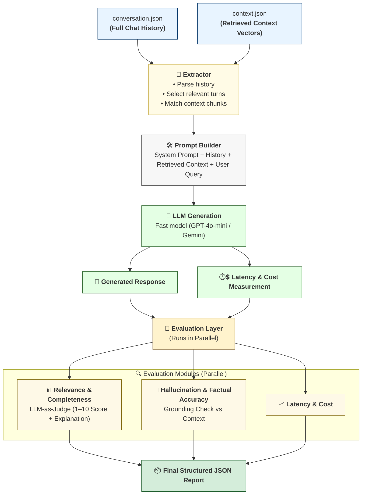

# EvalFlow — LLM Response Evaluation Pipeline
Automated Real‑Time Evaluation of Relevance, Grounding, Latency & Cost

## 📌 Overview
EvalFlow is a lightweight, scalable pipeline designed to evaluate the reliability of LLM responses in real-time.

Given two inputs:

- **conversation.json** → full chat history
- **context.json** → retrieved context vectors for one specific user query

EvalFlow automatically:

- Re-generates the AI response using history + retrieved context
- Measures latency & cost
- Evaluates the response on:
  - Response Relevance & Completeness
  - Hallucination / Factual Accuracy
  - Latency & Costs
- Produces a structured evaluation report as JSON.

EvalFlow can be run via:

- **FastAPI backend** (API for programmatic evaluation)
- **Streamlit UI** (drop two JSON files → get evaluation instantly)

The system is built for speed, minimal cost, and high scalability, suitable for production workflows with millions of daily LLM interactions.

## 📂 Project Structure
```
EvalFlow/
├── app/
│   ├── __init__.py
│   ├── config.py          # API keys, model config, thresholds
│   ├── evaluators.py      # Relevance + hallucination + grounding evaluators
│   ├── json_cleaner.py    # JSON parsing with auto-healing
│   ├── main.py            # FastAPI backend
│   ├── models.py          # Pydantic schemas
│   └── utils.py           # JSON parser, prompt builder, cost calculator
├── ui/
│   └── app.py             # Streamlit UI for file upload & evaluation
├── .env.example           # Template env file (add your keys)
├── .gitignore             # Git ignore rules
├── README.md              # (You are here)
├── requirements.txt       # Dependencies
├── sample-conversation.json  # Example conversation data
└── sample-context.json       # Example context vectors
```

## 🏗️ Architecture
Below is the full evaluation pipeline (Mermaid diagram):



## 🛠️ Tech Stack

### Backend
- **FastAPI** → API for running evaluations
- **uv** (Rust-based package manager) → super-fast dependency installation
- **asyncio** → parallel evaluator execution
- **Langchain - OpenAI / Gemini** → for response generation + judge LLM


### Frontend
- **Streamlit UI** → Upload conversation.json + context.json, click "Run Evaluation", get results

### Other
- **Pydantic** → strict data validation
- **dotenv** → API keys
- **Mermaid** → architecture documentation

## ⚙️ Local Setup Instructions

### 1. Clone the repository
```bash
git clone https://github.com/saikiranpulagalla/EvalFlow.git
cd EvalFlow
```

### 2. Create and activate a virtual environment using uv
```bash
# On Windows
uv venv .venv
.venv\Scripts\activate

# On macOS/Linux
uv venv .venv
source .venv/bin/activate
```

**Why a virtual environment?**
- **Dependency Isolation**: Keeps project dependencies separate from your system Python, preventing conflicts with other projects
- **Clean Environment**: Ensures reproducible builds and avoids "works on my machine" issues
- **Easy Cleanup**: Simply delete the `.venv` folder to remove all project dependencies
- **Production Readiness**: Virtual environments are the standard practice for Python projects

### 3. Install dependencies using uv
```bash
uv pip install -r requirements.txt
```

### 4. Create environment variables
```bash
cp .env.example .env
```
Add your API keys:
```
OPENAI_API_KEY=your_key
GEMINI_API_KEY=optional
MODEL_NAME=gpt-4o-mini
```

### 5. Run EvalFlow

Start the services in two separate terminals:

**Terminal 1 - Start FastAPI Backend**
```bash
uvicorn app.main:app --host 127.0.0.1 --port 8000 --reload
```

**Terminal 2 - Start Streamlit Frontend**
```bash
streamlit run ui/app.py 
```

Services will be available at:
- 📡 **FastAPI Backend**: http://localhost:8000
- 🎨 **Streamlit Frontend**: http://localhost:8501

### 6. Access the Application
- **Web UI**: Open http://localhost:8501 in your browser
- **API Health Check**: http://localhost:8000/health
- **API Docs**: http://localhost:8000/docs (Swagger UI)

## 🧪 Testing with Sample Files

EvalFlow includes sample JSON files for quick testing without preparing your own data:

### Sample Files Included
- **`sample-conversation.json`** - Multi-turn conversation about distributed systems
- **`sample-context.json`** - 8 context vectors with relevant sources

### Quick Test
1. Open http://localhost:8501 in your browser
2. In the "Input Files" section:
   - Upload `sample-conversation.json` as the conversation
   - Upload `sample-context.json` as the context
3. (Optional) Configure API keys in the sidebar, or use .env keys
4. Click **▶️ Run Evaluation**
5. View results in 8 sections: scores, response, prompt, metrics, hallucinations, context, explanations, and raw JSON

### Expected Output
The evaluation report will show:
- ✅ **Relevance Score** (1-10) - How well the response addresses the query
- ✅ **Completeness Score** (1-10) - Whether all aspects are covered
- ✅ **Accuracy Score** (1-10) - Factual correctness and hallucination assessment
- ⏱️ **Latency** - Time to generate response in milliseconds
- 💰 **Cost** - USD cost of API calls
- 🔍 **Retrieved Context** - Top 3 context vectors with similarity scores

### Your Own Data Format

**Conversation JSON** (`conversation.json`):
```json
{
  "conversation": [
    {"role": "user", "content": "What is distributed systems?"},
    {"role": "assistant", "content": "Distributed systems are..."},
    {"role": "user", "content": "How do you handle failures?"}
  ]
}
```

**Context JSON** (`context.json`):
```json
[
  {"text": "Byzantine fault tolerance is...", "source_url": "https://example.com/bft"},
  {"text": "Raft consensus algorithm ensures...", "source_url": "https://example.com/raft"}
]
```

## 📌 How EvalFlow Works

### Step 1 — Parse Inputs
- Load both JSONs
- Identify the latest user message
- Extract retrieved context
- Build a clean data structure

### Step 2 — Build Prompt
- System instructions
- Chat history
- Retrieved context
- Current user message

### Step 3 — Generate Model Response
Model receives:
- conversation history + context vectors + user query
- Timer starts → model responds → timer stops
- Count prompt tokens + completion tokens
- Compute cost

### Step 4 — Parallel Evaluation
Using asyncio, run evaluators simultaneously:

| Metric | Logic |
|--------|-------|
| Relevance & Completeness | LLM-as-judge scoring from 1–10 |
| Hallucination / Factual Accuracy | Grounding check using context + optional embedding similarity |
| Latency & Cost | Already measured in generation |

### Step 5 — Output JSON Report
Example:
```json
{
  "generated_response": "AI generated answer based on context and history",
  "relevance_score": 9,
  "completeness_score": 8,
  "accuracy_score": 7,
  "hallucinations": ["potential hallucination 1", "potential hallucination 2"],
  "latency_ms": 2500.5,
  "cost_usd": 0.00215,
  "retrieved_context": [
    {
      "text": "Relevant context chunk...",
      "source_url": "https://example.com/page",
      "similarity_score": 0.92
    }
  ],
  "prompt_used": "System: You are helpful assistant...\nHistory: ...\nContext: ...\nQuery: ...",
  "explanations": {
    "relevance_completeness": "Response addresses all aspects of the query with good detail",
    "accuracy_hallucination": "No factual inconsistencies detected with provided context"
  }
}
```

## 🧠 Why This Architecture?

### ✔ Designed for Real-Time Use
The assignment required a pipeline that evaluates responses as they are generated, not after the entire conversation.
This architecture evaluates one turn at a time, the way real systems work.

### ✔ Parallel Evaluation → Speed
We use asyncio for:
- relevance-completeness check
- hallucination-grounding check
- explanation generation

Running them together reduces latency 40–60%.

### ✔ Cheap & Scalable
Uses small judge models (GPT-4o-mini, Gemini-2.0-flash)

Only evaluates one message per request

Avoids re-running entire conversations

Embedding checks are optional

This ensures the system scales to:
- millions of daily LLM interactions
- with minimal compute cost.

### ✔ Modular
Each layer is independently replaceable:
- Swap model easily
- Plug new metrics
- Add Ragas scoring
- Replace judge LLM

## 📈 Scalability Considerations (Very Important for Evaluation)

### 1️⃣ Minimal Latency
- Only 1 LLM generation per request
- All evaluation LLM calls run asynchronously
- Small LLMs used for judging
- Optional Ragas avoids unnecessary calls

### 2️⃣ Minimal Cost
- Judge model = small/cheap
- Re-run only 1 turn, not entire conversation
- No redundant token usage
- Context is limited to retrieved vectors, not whole DB

### 3️⃣ Horizontal Scaling
- FastAPI can scale using uvicorn + workers
- Easy containerization for deployment
- Streamlit UI optional (not required in backend)

## 🚀 Future Enhancements
- Add contradiction detection across turns
- Confidence scoring (model uncertainty)
- Semantic drift analysis
- Web dashboard with historical analytics
- Vector-based hallucination scoring with Ragas

## 👨‍💻 Author
**Saikiran Pulagalla**
- GitHub: https://github.com/saikiranpulagalla
